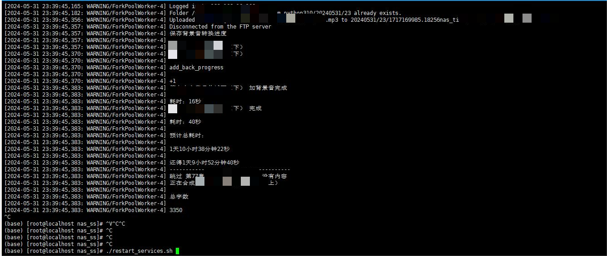
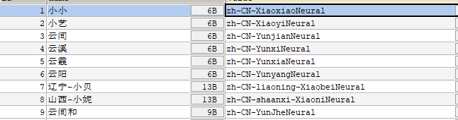
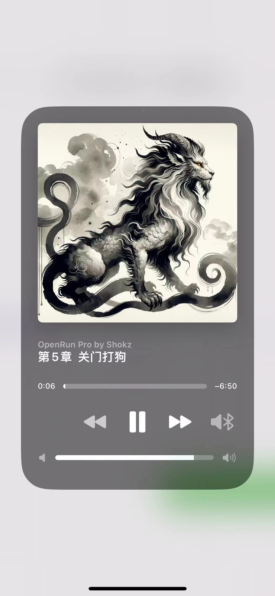

# nas_ss_app

# 注意

- 这只是前端，后端请参考 python django 实现的 https://github.com/JiJiBo/nas_ss.git
- 自行上传bgm文件，加在数据库里

# 介绍

- 由flutter开发的小说阅读软件
- 可以后台播放小说
- 声音优美，可自定义，选择多
- 支持上传txt或者通过链接，由后台爬取（只适配了七猫），更多功能，可以自己拓展
- 支持用户系统，支持token认证，支持后台任务

## 截图

## 选取文件

## 首页

## 详情页

## 更新

## 后台页面

## 音色

- 用的edge-tts 这里不全可以自己加

## iOS播放

# 开源许可证

GPL